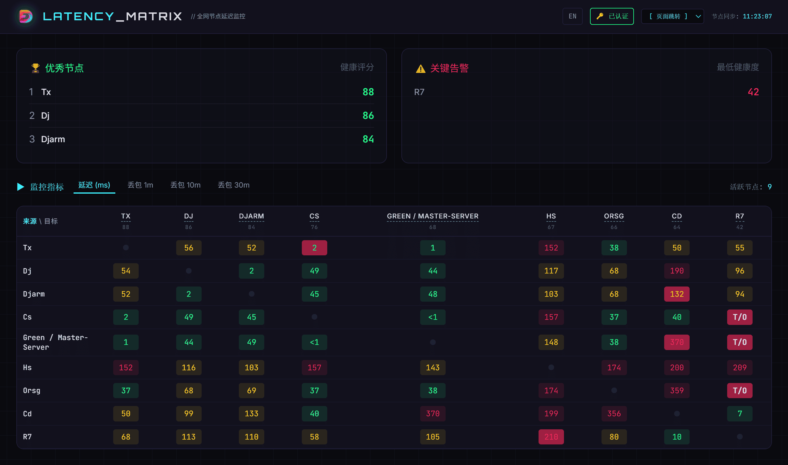
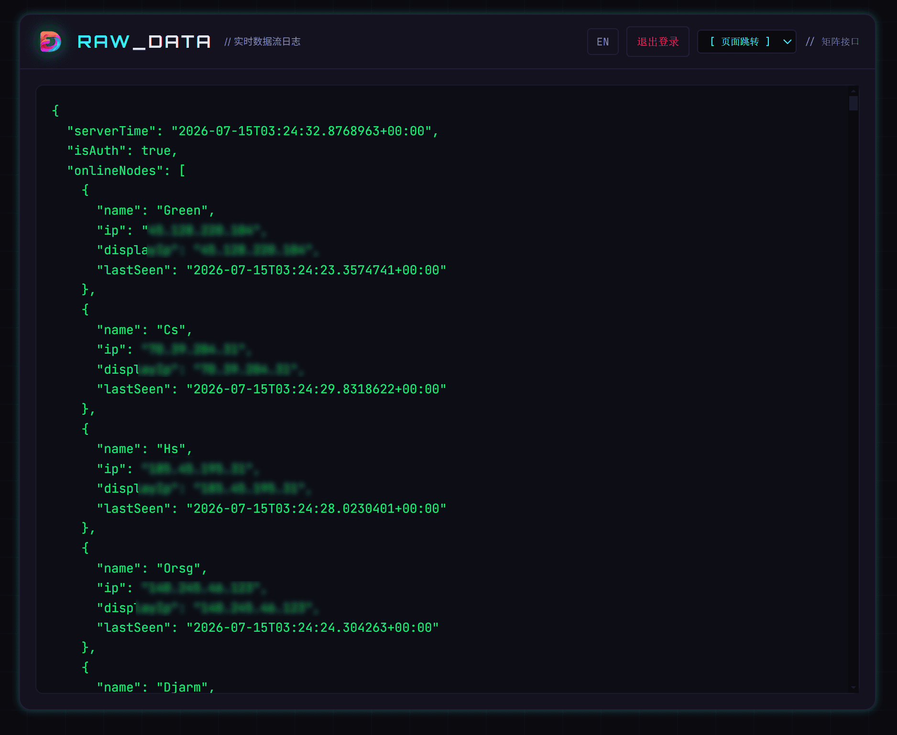
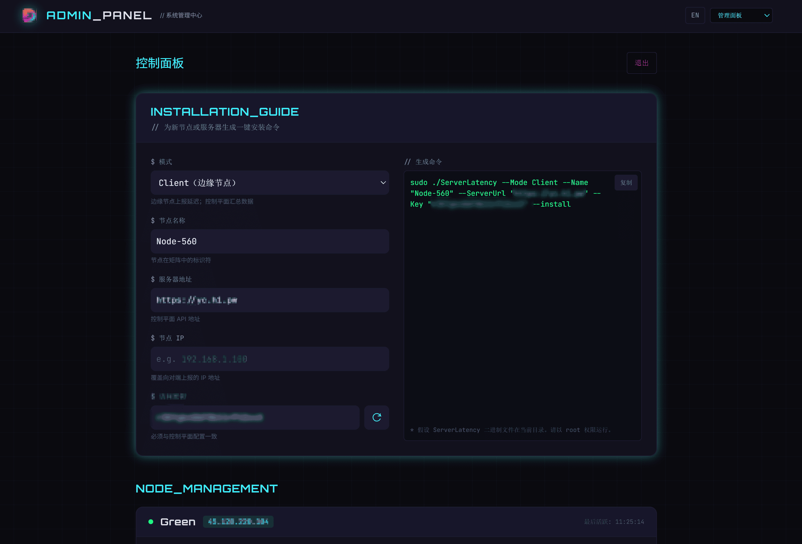
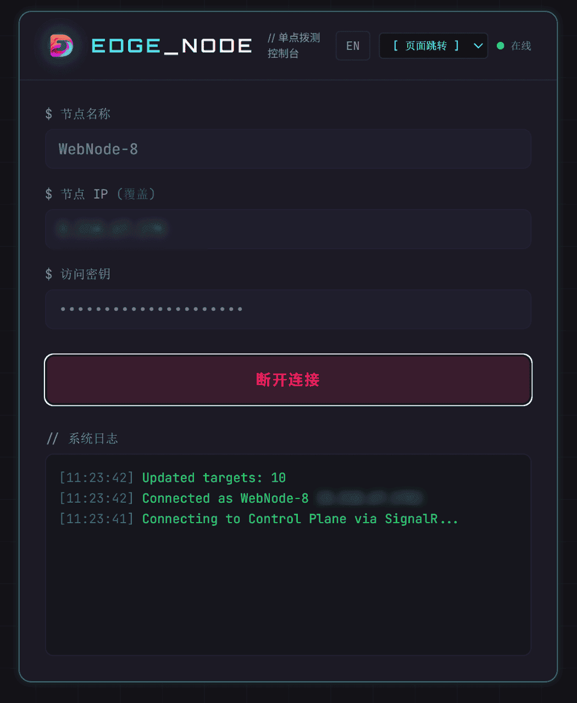

# ServerLatency

基于 .NET 10 Native AOT 构建的高性能服务器延迟监控系统。单一可执行文件同时支持 **Server (控制端)**、**Client (探测端)**、**Web Node (浏览器探测端)** 三种模式，实时生成节点间 N×N 延迟矩阵。

---

## 📖 目录

- [🌟 核心特性](#-核心特性)
- [📸 界面预览](#-界面预览)
- [⚡ 快速开始](#-快速开始)
- [🚀 运行模式详解](#-运行模式详解)
- [🖥️ Web 控制台](#️-web-控制台)
- [⚙️ 高级配置](#️-高级配置)
- [📦 生产环境部署](#-生产环境部署)
  - [Linux systemd 一键部署](#linux-systemd-部署-一键安装卸载)
  - [Docker 部署](#docker-部署)
- [🔌 API 接口参考](#-api-接口参考)
- [🏗️ 架构与工作流](#️-架构与工作流)
- [🔧 开发者指南 \& 编译](#-开发者指南)

---

## 🌟 核心特性

* **三种节点模式**：
  * **Server** — 控制面，维护在线节点、收发数据、提供可视化大屏，**同时自身作为 Master 节点参与 Ping**。
  * **Client** — 原生可执行探测端，SSE 长连接接收任务，ICMP Ping 后批量上报。
  * **Web Node** — 浏览器内置节点（`node.html`），无需部署二进制，用 `fetch HEAD` 探测可达性并上报（受浏览器同源策略限制，无法 ICMP）。
* **原生编译 (Native AOT)**：极低内存占用、毫秒级启动、无依赖独立运行，**单文件部署**（Web 静态资源内嵌）。
* **N×N 延迟矩阵**：节点间相互 Ping，服务端聚合生成全局矩阵，含最新延迟、1m/10m/30m 丢包率。
* **实时分发**：通过 **SignalR** 双向实时通信向在线节点推送待探测目标列表，毫秒级状态同步。
* **安全与隐私**：Shared Access Key 鉴权；游客模式 IP 自动脱敏（IPv4 显示为 `1.2.*.*`，IPv6 显示为 `IPv6-Masked`）。
* **Admin 控制台**：一键生成各节点部署命令，本地自动生成强随机密钥，轻松化管理。
* **反代适配**：内置 `ForwardedHeaders`，正确解析 Nginx / Cloudflare 等反向代理后的真实客户端 IP。
* **多语言与移动端**：Web UI 完美适配移动端（Safe-area、底部导航），支持中英双语实时切换。

---

## 📸 界面预览

| 延迟矩阵大屏 (Matrix) | 原始数据视图 (Data) |
| :---: | :---: |
|  |  |
| **一键安装生成器 (Admin)** | **浏览器免部署节点 (Web Node)** |
|  |  |

---

## ⚡ 快速开始

### 一键安装（Linux 推荐）

> 下载二进制 → 注册为 systemd 服务 → 开机自启，一条命令搞定。

**安装服务端：**

```bash
URL="https://github.com/csvkse/ServerLatency/releases/latest/download/ServerLatency-linux-x64.tar.gz"; \
(curl -fsSL $URL || wget -qO- $URL) | tar -xz && chmod +x ServerLatency && \
sudo ./ServerLatency -m Server -p 15002 -k "MySecretKey" --install
```

**安装客户端探测节点：**

```bash
URL="https://github.com/csvkse/ServerLatency/releases/latest/download/ServerLatency-linux-x64.tar.gz"; \
(curl -fsSL $URL || wget -qO- $URL) | tar -xz && chmod +x ServerLatency && \
sudo ./ServerLatency -m Client -u "http://your-server-ip:15002" -k "MySecretKey" -n "Worker-01" --install
```

> 安装完成后服务立即启动，查看状态：`sudo systemctl status serverlatency`  
> 可在 **Admin 面板 → Installation Guide** 页面可视化生成以上命令。

### 手动运行（前台调试）

```bash
# 下载 Linux 单文件
URL="https://github.com/csvkse/ServerLatency/releases/latest/download/ServerLatency-linux-x64.tar.gz"
(curl -fsSL $URL || wget -qO- $URL) | tar -xz
chmod +x ServerLatency

# 启动服务端 (控制面 + 大屏)
./ServerLatency -m Server -p 15002 -k "MySecretKey"

# 另一台机器启动客户端探测节点
./ServerLatency -m Client -u "http://your-server-ip:15002" -k "MySecretKey" -n "Worker-01"

# 浏览器打开大屏
# 游客: http://your-server-ip:15002/
# 管理: http://your-server-ip:15002/?key=MySecretKey
```

---

## 🚀 运行模式详解

### 1. 服务端模式 (Server)

控制面：维护节点列表、接收上报、提供大屏，**自身作为 Master 节点**每 10 秒主动 Ping 全部在线节点。

```bash
./ServerLatency -m Server -p 15002 -k "MySecretKey"
```

启动后：
- 监听 `0.0.0.0:15002`（`ListenAnyIP`，支持 IPv4/IPv6）。
- `ServerLatencyWorker` 后台任务通过多 API 轮询 (`api.ipify.org`, `ip.sb` 等) 获取本机公网 IP，注册为 `Master-Server` 节点并参与 Ping。
- 浏览器 Web 大屏（`index.html`, `admin.html`）随服务启动即可访问。

### 2. 客户端模式 (Client)

原生探测端：SSE 连接 Server，接收目标列表后 ICMP Ping，每 10 秒心跳上报。

```bash
# 命令行参数
./ServerLatency -m Client -u "http://your-server-ip:15002" -k "MySecretKey" -n "Worker-01"

# 指定替代 IP（NAT 后 / 指定公网 IP 场景；会覆盖被探测目标 IP）
./ServerLatency -m Client -u "http://your-server-ip:15002" -k "MySecretKey" -n "Worker-01" -ip "1.2.3.4"

# 位置参数快速启动格式: [ServerUrl] [AccessKey] [NodeName]
./ServerLatency "http://your-server-ip:15002" "MySecretKey" "Worker-01"
```

> **💡 获取真实 IP 失败时的解决方案 (反代/K3S 环境)**
> 
> 如果你的 Server 部署在复杂的容器网络或反向代理（如 K3S / Traefik / Docker 端口映射）后方，服务端可能无法直接拿到客户端底层的真实外网 IP。
> 此时建议在启动客户端时，通过 `--Ip` 参数配合 `curl` 让客户端自动获取并主动上报自身的真实外网 IP：
> ```bash
> ./ServerLatency -m Client --Key "MySecretKey" --ServerUrl "http://your-server-ip:15002" --Name "Worker-01" --Ip "$(curl -s https://api.ip.sb/ip)"
> ```

### 3. 浏览器节点模式 (Web Node)

无须部署二进制。访问 `http://your-server-ip:15002/node.html`，填节点名与密钥即可成为探测节点。

行为细节：
- 收到目标列表后用 `fetch(target, {method:'HEAD', mode:'no-cors'})` 探测可达性。
- **无法 ICMP**，仅能判断 HTTP 可达；延迟为请求耗时近似值。适合临时、免部署补充节点。

---

## 🖥️ Web 控制台

访问服务端的根路径即可进入 Web 控制台。系统自带四组核心视图：

| 页面 | 路径 | 用途 |
|------|------|------|
| **延迟矩阵** | `/index.html` | N×N 延迟矩阵大屏，内含各节点动态历史曲线图，2 秒轮询刷新 |
| **浏览器节点** | `/node.html` | 浏览器探测端控制面板 |
| **监控数据** | `/data.html` | 原始监控数据视图，可查看细粒度的 Ping 成功率及时间戳 |
| **管理面板** | `/admin.html` | 一键安装代码生成器，支持在线调整节点模式与自动配置密钥 |

**权限控制：游客模式 vs 管理员模式**
- **游客**：直接访问 `http://ip:port/`，IP 强制脱敏（IPv4 → `1.2.*.*`，IPv6 → `IPv6-Masked`）。
- **管理员**：访问 `http://ip:port/?key=MySecretKey`（或在面板中登录），查看真实 IP 与完整矩阵。

---

## ⚙️ 高级配置

配置优先级：**命令行参数 > Docker 环境变量 > appsettings.{ENV}.json > appsettings.json > 默认值**。

### 环境变量 (推荐 Docker 用户使用)

| 扁平变量名 | 对应层级配置 | 描述 | 默认值 |
|--------|----------|------|--------|
| `MODE` | `Mode` | 运行模式 (`Server` / `Client`) | `Client` |
| `ACCESS_KEY` | `AccessKey` | 认证密钥（空则关闭鉴权） | (空) |
| `SERVER_PORT` | `ServerConfig:Port` | [Server] 监听端口 | `15002` |
| `SERVER_NAME` | `ServerConfig:ServerName` | [Server] 服务端节点名称 | `Master-Server` |
| `SERVER_URL` | `NodeConfig:ServerUrl` | [Client] 控制端地址 | `http://localhost:15002` |
| `NODE_NAME` | `NodeConfig:NodeName` | [Client] 节点名称 | `Node_{MachineName}` |
| `NODE_IP` | `NodeConfig:NodeIp` | [Client/Server] 替代 IP（覆盖自动识别） | (空) |

### 命令行参数

支持短参数 (`-`) 与长参数 (`--`)：

| 参数 | 全称 | 对应配置 | 说明 |
|------|------|----------|------|
| `-m` | `--Mode` | `Mode` | 运行模式 (`Server` / `Client`) |
| `-p` | `--Port` | `ServerConfig:Port` | [Server] 监听端口 |
| `-k` | `--Key` | `AccessKey` | 认证密钥 |
| `-n` | `--Name` | `NodeConfig:NodeName` | [Client] 节点名称 |
| `-u` | `--ServerUrl` | `NodeConfig:ServerUrl` | [Client] 控制端地址 |
| `-ip` | `--Ip` | `NodeConfig:NodeIp` | [Client/Server] 替代 IP（覆盖自动识别与被探测 IP） |
| `-i` | `--install` | — | [Linux] 注册 systemd 服务 |
| `-u`(卸载) | `--uninstall` | — | [Linux] 卸载 systemd 服务 |

---

## 📦 生产环境部署

### Linux systemd 部署 (一键安装/卸载)

项目内置 systemd 服务注册命令，**无需手写 unit 文件**。在 Linux 上以 `root` 执行：

```bash
# 安装服务端 (服务名 serverlatency)
sudo ./ServerLatency-linux-x64 -m Server -p 15002 -k "MySecretKey" --install

# 常用管理命令
sudo systemctl status serverlatency        # 查看状态
sudo systemctl restart serverlatency       # 重启
journalctl -u serverlatency -f             # 实时日志

# 卸载服务
sudo ./ServerLatency-linux-x64 --uninstall
```

> ⚠️ 服务名固定为 `serverlatency`。同机只能装一个实例（Server 或 Client 二选一）。

### Docker 部署

```bash
# 启动服务端
docker run -d --restart always \
  --name latency-server \
  -p 15002:15002 \
  -e MODE="Server" \
  -e ACCESS_KEY="MySecretKey" \
  ghcr.io/csvkse/serverlatency:latest

# 启动客户端
docker run -d --restart always \
  --name latency-client \
  -e MODE="Client" \
  -e SERVER_URL="http://your-server-ip:15002" \
  -e ACCESS_KEY="MySecretKey" \
  -e NODE_NAME="Shanghai-Node" \
  ghcr.io/csvkse/serverlatency:latest
```

---

## 🔌 API 接口参考

所有接口前缀 `/api/ServerLatency`。设置 `AccessKey` 后，除 `Matrix` 接口外均需 `key` 参数鉴权。

| 方法 | 路径 | 鉴权 | 说明 |
|------|------|------|------|
| `POST` | `/Auth` | `key` | 验证密钥是否有效，返回 `Authorized` |
| `GET` | `/Matrix` | 可选 | 返回延迟矩阵。带 `key` 返回真实 IP 且含 5 分钟历史数组，不带则脱敏 |

**SignalR Hub (`/latencyHub`) 方法：**
- `JoinPingNode(name, key, ip)`: 节点注册
- `Report(items, key)`: 上报探测结果
- **Client 事件监听**: `Welcome`, `UpdateTargets`

> 实时阈值 60 秒：节点 60 秒内无 Connect 心跳或 Report 上报即视为离线，从矩阵移除。历史保留 35 分钟。

---

## 🏗️ 架构与工作流

```
                         ┌──────────────────────────┐
                         │       Server (Master)     │
                         │  · 维护在线节点列表         │
                         │  · 接收 Report / 输出 Matrix│
                         │  · 自身拉公网IP参与 Ping    │
                         │  · Web 大屏 (内嵌 wwwroot) │
                         └────────────┬─────────────┘
                  SignalR (UpdateTargets) │  SignalR (Report)
            ┌──────────────────────────┼──────────────────────────┐
            ▼                          ▼                          ▼
     ┌─────────────┐           ┌─────────────┐           ┌─────────────────┐
     │   Client    │           │   Client    │           │   Web Node       │
     │  ICMP Ping  │  ……       │  ICMP Ping  │           │ fetch HEAD no-cors│
     │  批量上报    │           │  批量上报    │           │  可达性上报       │
     └─────────────┘           └─────────────┘           └─────────────────┘
```

**数据流**：
1. 节点通过 `/latencyHub` 建立 SignalR 长连接并注册。
2. 当有节点上下线时，Server 向所有在线节点广播 `UpdateTargets` 事件。
3. 节点收到目标列表后立即 Ping（Client ICMP / Web Node HEAD），并将结果上报。
4. Server 将结果写入内存历史，同时 Server 自身每 10 秒主动 Ping 全部其他节点。
5. Web 大屏每 2 秒轮询 `/api/ServerLatency/Matrix` 渲染延迟矩阵。

> 全程**纯内存**，无数据库。节点状态、延迟历史均存于 `ServerState` 的并发字典，进程重启即清空。

---

## 🔧 开发者指南

### 项目结构

| 文件 | 职责 |
|------|------|
| `ServerLatency.csproj` | 核心项目，Minimal API + `PublishAot`，`wwwroot/**` 作 `EmbeddedResource` 内嵌 |
| `Program.cs` | 入口点：拦截指令、环境变量映射、配置加载、模式分发 |
| `Server/` | 服务端核心（SignalR 枢纽、矩阵计算、API 接口） |
| `Client/` | 客户端核心（SSE 监听、ICMP Ping 封装、状态上报） |
| `Serialization/` | AOT 兼容的 `JsonSerializerContext` 注册表 |
| `wwwroot/` | 纯前端静态资源，Vue 3 + Tailwind CSS |

### 编译发布 (Native AOT)

Native AOT 编译为无依赖单文件，**Web 静态资源会自动内嵌**。

**Windows (x64)：**
```powershell
dotnet publish -c Release -r win-x64
```

**Linux (x64) — Docker 交叉编译（推荐）：**
.NET AOT 不支持跨 OS 交叉编译，Windows 上可用提供的 Docker 脚本构建 Linux 产物：
```powershell
./build-linux-aot.ps1
```

> **注意：AOT 与反射**。AOT 环境不支持运行时反射序列化，新增的 DTO 必须在 `Serialization/AppJsonContext.cs` 中注册 `[JsonSerializable]`，否则运行时将抛出异常。

### 测试命令

```bash
# 启动服务端
URL="https://github.com/csvkse/ServerLatency/releases/latest/download/ServerLatency-linux-x64.tar.gz"; (curl -fsSL $URL || wget -qO- $URL) | tar -xz && chmod +x ServerLatency && ./ServerLatency -m Server -p 15002 -k "MySecretKey"

# 启动客户端
URL="https://github.com/csvkse/ServerLatency/releases/latest/download/ServerLatency-linux-x64.tar.gz"; (curl -fsSL $URL || wget -qO- $URL) | tar -xz && chmod +x ServerLatency && ./ServerLatency -m Client --Key "MySecretKey" --ServerUrl "http://your-server-ip:15002" --Name "Worker-01"
```
